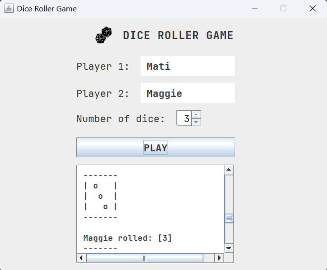

# 🎲 Java Dice Roller Game (GUI)

A two-player **dice rolling game built in Java with a graphical user interface (Swing)**.  
The game features animated dice rolls, timed pauses between turns, automatic player switching, and a final score system.

This project demonstrates **object-oriented design, game state management, event-driven programming, and GUI animation using Swing Timers**.

---

## 🚀 Features

- ✅ Two-player mode
- ✅ Configurable number of dice per turn
- ✅ Animated dice rolling using `Timer`
- ✅ One-second pause between each roll
- ✅ Automatic turn switching
- ✅ Final score calculation and winner detection
- ✅ Full GUI output (no console dependency)
- ✅ Clean OOP design with separated model and UI

---

## 🎲 Screenshot

<p align="center">
  
</p>

---

## 🧠 Architecture Overview

The project follows a clean **Model + GUI Controller structure**:

### 🧩 Model Layer (`game` package)
- `Player` → Stores player name and score
- `Dice` → Pure logic class for random dice rolls (1–6)
- `Game` → Holds game state (players, dice, number of rolls)

### 🖥️ GUI Layer (`ui` package)
- `MainWindow` → Handles:
  - User input
  - Dice animation
  - Timed pauses
  - Turn flow
  - Score display
  - Winner announcement

---

## 🛠️ Technologies Used

- Java 17+
- Swing GUI
- Event-driven architecture
- `javax.swing.Timer` for animations
- Object-Oriented Programming (OOP)

---

## ▶️ How to Run

1. Open the project in **NetBeans**
2. Make sure the `MainWindow` is set as the **Main Class**
3. Click **Run**
4. Enter:
   - Player names
   - Number of dice per turn
5. Click **Play** and enjoy the animated game 🎮

---

## 🕹 How it works

1. Enter a name for **Player 1**
2. Enter a name for **Player 2**
3. Select how many dice each player rolls
4. Click **PLAY**
5. Watch the results in the output window

---

## 📸 Gameplay Flow

1. Player 1 rolls all dice (animated)
2. Automatic 2-second pause between rolls
3. Player 2 rolls all dice
4. Final scores are displayed
5. Winner (or tie) is announced

---

## 💡 Game Logic

The `Game` class:
- manages both players
- controls scoring
- determines winner
- outputs results in GUI text area

The `Dice` class:
- only returns random values from 1 to 6
- GUI handles ASCII display

---

## 📦 Project Structure

```bash
DiceRoller/
├── src/
│   ├── game/
│   │   ├── Dice.java
│   │   ├── Game.java
│   │   └── Player.java
│   └── ui/
│       └── MainWindow.java
├── assets/
│   └── images/
│       └── sampleWindow.png
├── README.md
└── pom.xml   (if using Maven)
```

## 👨‍💻 Author

Developed by **Matias Scalella**\
As part of personal practice and Java portfolio development.

------------------------------------------------------------------------

## 📄 License

This project is open-source and available for educational and personal
use.
